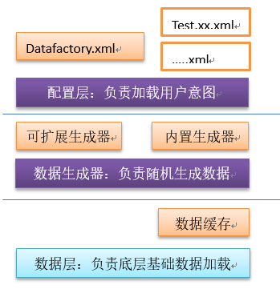
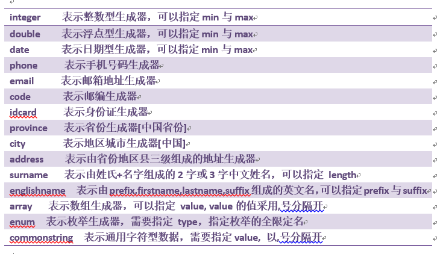

## DSM-DataFactory
> 为适应在开发或教学过程中模拟各种数据,需要有一组件工具直接帮助我们生成们希望的数据，在传统地开发模式下我们总是在junit中来手动模拟数据，针对量不大的情况下，我们还能应付得过来，但是一旦要模拟成百上千个实体对象时总会为使用什么样的 数据而烦恼，并且需要耗费大量的时间去思考这个事情。数据工厂就是为在测试环境中解决这些数据问题而生的，它可以通过配置方式来给任意实体的任意属性模拟数据，并且可以控制数据的范围、大小以及是否重复类型等，可以非常方便地让测试者生成任意数据量的“ 真实数据 ”[相对真实 ]

## 软件架构
> 本软件采用三层架构，每层之间通过抽象层相连，具有良好的可扩展性，对于用户来说，只需要按照即定的步骤使用即可



## 开发者向导
> 首先，导入 datafactory-snapshot.jar的jar包, 注意，此组件只需要在测试环境下使用。然后，在test源文件下创建 datafactory.xml 文件，内容如下：

```xml
<?xml version="1.0" encoding="UTF-8"?>
<data-factory>
	<load file="com/df/entity/test.student.xml"/>
	<load file="com/df/entity/test.book.xml"/>
</data-factory>
```

> 针对XSD的导入，可以不考虑

> 其次，创建你需要生成的实体类的数据工厂测试文件，文件名一般为：test.实体名.xml, 如：`test.Student.xml` ，内容如下：

```xml
<?xml version="1.0" encoding="UTF-8"?>
<class name="com.df.entity.Student" item="10">
	<property name="name" generator="englishname" prefix="true" suffix="true"/>
	<property name="age" generator="integer" min="15" max="28"/>
	<property name="hobby" generator="array" value="看书,阅读,网游"/>
	<property name="birth" generator="date"/>
	<property name="gender" generator="enum"  type="com.df.generate.Gender"/>
</class>
```

有关`<property>`元素中所有的属性解释如下：

Name 属性：  表示实体的属性名
Generator属性： 表示生成策略缩略名.
...

> 本工具内置了15个生成策略，如下：



其中，

Min 属性：表示指定最小范围  
Max 属性：表示指定最大范围  
Precision属性：　表示浮点数的精度  
Length属性：　表示指定中文姓名的长度，一般是１或２  
Type　属性：　表示枚举类型的全限定名  
Value 属性：　表示数组或通用型字符串的值，以,号分隔开的字符序列  
Unique 属性：　表示此生成的值是否唯一  
Prefix 属性：　　表示英文名是否有前缀  
Suffix 属性：　表示英文名是否有后缀  

以上所有的generator及属性，都可以参考xsd[schema]　来写入，schema会提供提示。

## 注意
> 写datafactory.xml文件所依赖的schema文件路径为：datafactory.jar/META-INF/datafactory.xsd文件,写test.xxx.xml文件所依赖的schema路径为：datafactory.jar/META-INF/test.df.xml.xsd　文件

## 展望
> 更加完善功能，同时开发更多的工具。
